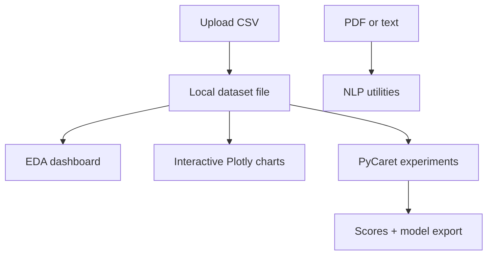
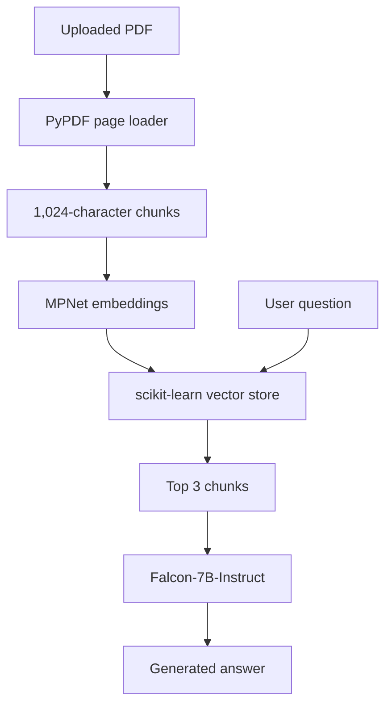

<div align="center">

# AutoMLapp

### Interactive data exploration, baseline AutoML, and practical NLP in Streamlit

[](https://www.python.org/)
[](https://streamlit.io/)
[](https://pycaret.org/)
[](https://scikit-learn.org/)
[](https://plotly.com/python/)
[](https://huggingface.co/models)

A multi-page Streamlit application for exploring CSV datasets, comparing baseline machine-learning models, exporting trained models, and running document Q&A, emotion analysis, zero-shot classification, and grammar correction.

[Features](#features) · [Workflow](#application-workflow) · [AutoML](#automl-workflows) · [NLP](#nlp-utilities) · [Installation](#quick-start) · [Troubleshooting](#troubleshooting)

</div>

---

## Overview

AutoMLapp brings common early-stage data-science workflows into one browser interface. A user can upload a CSV file, inspect its schema and data quality, create interactive visualizations, compare baseline models with PyCaret, download the selected model, and experiment with several NLP pipelines.

The application is designed for:

- rapid dataset assessment;
- educational AutoML demonstrations;
- baseline modelling before deeper experimentation;
- lightweight NLP prototyping;
- portfolio demonstrations of end-to-end Streamlit workflows.

No coding is required to use the interface after installation.

## Features

### Data exploration

- Upload any standard CSV dataset
- Inspect row count, column count, missing values, and duplicates
- Preview the first 100 records
- Review data types, non-null counts, missing percentages, and cardinality
- Generate descriptive statistics across numeric and categorical columns
- Explore numeric distributions with histograms and box plots
- Visualize numeric correlations with an interactive heatmap
- Review the 20 most frequent categorical values
- Inspect missing values by column

### Interactive visualization

- Build Plotly scatter plots without writing code
- Select numeric X and Y axes
- Colour observations by any available column
- Zoom, pan, hover, and export through Plotly controls

### Baseline AutoML

- Compare regression models with PyCaret
- Compare classification models with PyCaret
- Run DBSCAN clustering experiments
- Display the selected estimator and complete score table
- Inspect estimator parameters
- Use a fixed session seed (`42`) for repeatable setup behavior
- Save and download the resulting `.pkl` model

### NLP utilities

- Retrieval-augmented question answering over PDF documents
- Emotion/sentiment classification with EmoRoBERTa
- Zero-shot text classification with BART-MNLI
- Grammar correction with a T5 model

## Application workflow



### Navigation

| Page | Purpose | Output |
| --- | --- | --- |
| Upload dataset | Read and store a CSV file | Data preview and local `dataset.csv` |
| Data analysis | Profile structure, statistics, and quality | Metrics, tables, distributions, and correlations |
| Data visualisation | Explore numeric relationships | Interactive Plotly scatter plot |
| ML models | Run supervised or unsupervised baselines | Selected model, leaderboard, scores, and parameters |
| Download model | Export the trained estimator | `best_model.pkl` |
| NLP | Run one of four language tasks | Answer, label, emotion, or corrected text |

## Exploratory data analysis

The built-in dashboard replaces the heavier YData Profiling integration used by earlier versions of the project. This avoids known pandas compatibility problems while keeping the most useful exploratory views directly inside Streamlit.

### Overview tab

- first 100 rows;
- column types;
- non-null and missing counts;
- missing percentage;
- unique-value count;
- descriptive statistics.

### Numeric columns tab

- selectable numeric feature;
- 30-bin histogram;
- outlier-aware box plot;
- full correlation matrix when at least two numeric columns exist.

### Categorical columns tab

- selectable categorical feature;
- missing values represented explicitly;
- horizontal bar chart of the 20 most frequent values.

### Data quality tab

- missing-value counts by column;
- duplicate-row count;
- clear success messages when no issue is detected.

## AutoML workflows

### Regression

Choose **Regression** when the target is continuous and numeric. PyCaret prepares the data, evaluates its supported regression estimators, and selects the best baseline under its comparison configuration.

### Classification

Choose **Classification** when the target represents discrete classes, including text labels such as `Setosa`, `Versicolor`, or `Fraud`.

### Clustering

Choose **Clustering** to fit a DBSCAN model without a supervised target. The application displays the clustering score table returned by PyCaret and exports the fitted pipeline.

### Reproducibility

Every PyCaret `setup` call uses:

```python
session_id=42
```

The chosen estimator is saved through PyCaret as:

```text
best_model.pkl
```

> [!IMPORTANT]
> AutoML comparison produces a baseline, not a production-ready model. Validate the target, preprocessing, leakage risk, cross-validation design, business metric, fairness, and out-of-sample performance before deployment.

## Model results and export

After modelling completes, the interface displays:

- selected estimator class;
- readable estimator representation;
- PyCaret comparison or clustering metrics;
- complete estimator parameter table;
- local model path.

The **Download model** page makes the serialized pipeline available as `best_model.pkl`.

> [!CAUTION]
> Python pickle files can execute code while loading. Only load model artifacts that you created or obtained from a trusted source, and recreate the original dependency environment whenever possible.

## NLP utilities

### 1. Document Q&A

The document assistant builds a temporary retrieval pipeline for an uploaded PDF:



| Component | Implementation |
| --- | --- |
| PDF loading | LangChain `PyPDFLoader` |
| Chunking | 1,024 characters with 64-character overlap |
| Embeddings | `sentence-transformers/all-mpnet-base-v2` |
| Retrieval | `SKLearnVectorStore`, top 3 chunks |
| Hosted language model | `tiiuae/falcon-7b-instruct` through Hugging Face Hub |
| Chain | RetrievalQA with `stuff` context combination |

This task requires a Hugging Face Hub token and network access.

### 2. Emotion analysis

The interface uses:

```text
arpanghoshal/EmoRoBERTa
```

The pipeline returns the highest-scoring emotion label and confidence percentage for the supplied sentence.

### 3. Zero-shot classification

The user provides a sentence and comma-separated candidate labels. The application uses:

```text
facebook/bart-large-mnli
```

It returns the highest-ranked label and its confidence score without task-specific fine-tuning.

### 4. Grammar correction

The grammar assistant uses Happy Transformer with:

```text
vennify/t5-base-grammar-correction
```

Generation runs with five-beam search and returns a corrected sentence.

## Project structure

```text
.
├── app.py                              # Streamlit entry point
├── help.py                             # Backward-compatible PDF-QA wrapper
├── src/automl_app/
│   ├── __init__.py
│   ├── app.py                          # Pages, state, modelling, and NLP UI
│   └── services/
│       ├── __init__.py
│       └── document_qa.py              # PDF retrieval-QA pipeline
├── .gitignore
├── requirements.txt
└── README.md
```

The following runtime artifacts are intentionally excluded from Git:

```text
dataset.csv
uploaded_file.pdf
best_model.pkl
document_vector_db.parquet
.env
```

## Quick start

### Prerequisites

- Python **3.11** recommended
- `pip`
- A modern browser
- Internet access for initial NLP model downloads
- A Hugging Face token only for document Q&A

The PyCaret, Numba, and scientific Python versions are intentionally pinned. Python 3.11 provides the safest installation path for this dependency set.

### 1. Clone the repository

```bash
git clone https://github.com/younesgu/AutoMLapp.git
cd AutoMLapp
```

### 2. Create a clean environment

```powershell
# Windows PowerShell
py -3.11 -m venv .venv
.venv\Scripts\Activate.ps1
```

```bash
# macOS or Linux
python3.11 -m venv .venv
source .venv/bin/activate
```

### 3. Install dependencies

```bash
python -m pip install --upgrade pip
python -m pip install --prefer-binary -r requirements.txt
```

The first installation may take several minutes because PyCaret includes a broad scientific Python stack.

### 4. Launch the application

```bash
python -m streamlit run app.py
```

Open <http://localhost:8501> if Streamlit does not open automatically.

## Configure document Q&A

Create `.env` in the repository root:

```dotenv
HUGGINGFACEHUB_API_TOKEN=your_hugging_face_token
```

Restart Streamlit after saving the token.

The embedding model runs through Sentence Transformers, while the final question-answering prompt and retrieved PDF context are sent to the configured Hugging Face hosted model.

> [!WARNING]
> Do not use document Q&A with confidential PDFs unless external processing through Hugging Face has been explicitly approved by your organization.

The other NLP models are downloaded on first use and cached by the Hugging Face libraries. Downloads can require significant time, memory, and disk space.

## Usage guide

### Explore a dataset

1. Open **Upload dataset**.
2. Upload a `.csv` file.
3. Open **Data analysis** to inspect quality and distributions.
4. Use **Data visualisation** for interactive relationships.

### Compare supervised models

1. Upload the dataset.
2. Open **ML models**.
3. Select the target column.
4. Choose **Regression** for a continuous numeric target or **Classification** for class labels.
5. Click **Run modelling**.
6. Review the leaderboard, selected model, and parameters.
7. Open **Download model** to export the pipeline.

### Run clustering

1. Upload a dataset containing meaningful modelling features.
2. Open **ML models** and choose **Clustering**.
3. Click **Run modelling** to fit DBSCAN.
4. Review the returned cluster metrics and exported model.

### Use an NLP task

1. Open **NLP**.
2. Select the task.
3. Provide the required PDF, text, labels, or question.
4. Run the task and review the result.

## Local files and privacy

AutoMLapp writes working artifacts to the repository directory:

| File | Contents | Lifecycle |
| --- | --- | --- |
| `dataset.csv` | Most recently uploaded dataset | Replaced by the next CSV upload |
| `uploaded_file.pdf` | Most recently uploaded PDF | Replaced by the next PDF upload |
| `best_model.pkl` | Most recently saved PyCaret model | Replaced by later modelling runs |

These files are ignored by Git but remain on the local filesystem until replaced or deleted. Do not assume that uploaded information disappears when the browser tab closes.

## Troubleshooting

### Recommended clean-environment reset

When scientific Python packages conflict, recreating only the project environment is usually the safest fix:

```powershell
# Windows PowerShell
deactivate
Remove-Item -Recurse -Force .venv
py -3.11 -m venv .venv
.venv\Scripts\Activate.ps1
python -m pip install --upgrade pip
python -m pip install --prefer-binary -r requirements.txt
```

### Common problems

| Error or symptom | Likely cause | Solution |
| --- | --- | --- |
| `Matplotlib requires numpy>=...` | Packages were installed independently with conflicting versions | Recreate `.venv` and install only from `requirements.txt` |
| `NDFrame.infer_objects() got an unexpected keyword argument 'copy'` | Incompatible pandas/YData Profiling versions from an older environment | Recreate `.venv`; the current app no longer uses YData Profiling |
| `'DataFrame' object has no attribute 'profile_report'` | Old application code or missing profiling integration | Pull the current version; analysis is now built into `render_analysis` |
| `could not convert string to float: 'Setosa'` | Regression was selected for a categorical target | Choose **Classification** for discrete labels |
| `streamlit` is not recognized | The virtual environment is inactive | Activate `.venv` or run `python -m streamlit run app.py` |
| Hugging Face token error | `HUGGINGFACEHUB_API_TOKEN` is missing | Add the token to `.env` and restart Streamlit |
| NLP task appears frozen | A large model is downloading or loading | Check network activity and wait for the first model load |
| Memory error during modelling | The dataset or model comparison exceeds available RAM | Sample the data, reduce features, or use a machine with more memory |

## Development checks

The repository currently has no automated test suite. A lightweight syntax check can be run with:

```bash
python -m compileall app.py help.py src
```

Recommended next checks include unit tests for CSV handling, dataset requirements, feature selection, model persistence, and mocked NLP services.

## Limitations

- CSV files are loaded fully into memory.
- Uploaded datasets and PDFs are stored in the project directory.
- The application supports one local working dataset and model at a time.
- PyCaret model comparison can be slow on large datasets or CPU-only machines.
- DBSCAN parameters are currently fixed by the PyCaret default workflow.
- The interface does not expose preprocessing, validation, or cross-validation controls.
- NLP models are large and can require substantial RAM and disk space.
- Document Q&A depends on a hosted model and an external token.
- Generated answers and zero-shot labels can be inaccurate.
- There is no authentication, user isolation, persistent experiment tracking, or automated test suite.

## Responsible use

- Confirm that uploaded datasets and PDFs may legally be processed.
- Remove sensitive or personally identifiable information when possible.
- Review model outputs for leakage, bias, and class imbalance.
- Never deploy the selected baseline without independent validation.
- Treat NLP output as assistance, not verified fact.
- Keep API tokens in `.env` and never commit them to Git.

